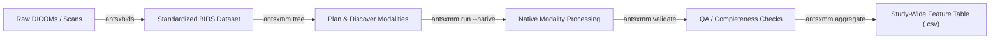

# ANTsXMM

**ANTsXMM** is the modern BIDS multimodal image processing and orchestration framework for the [ANTsX ecosystem](https://github.com/ANTsX). Tailored specifically to consume standardized BIDS datasets curated by [**antsxbids**](https://github.com/ANTsX/antsxbids), ANTsXMM extracts biological metrics across structural, diffusion, functional, perfusion, and metabolic neuroimaging modalities with mathematical parity and zero legacy overhead.

[](https://github.com/stnava/antsxmm)
[](https://github.com/stnava/antsxmm)
[](https://www.python.org)
[](LICENSE)


Full API documentation is available [here](https://htmlpreview.github.io/?https://raw.githubusercontent.com/stnava/antsxmm/main/docs/antsxmm.html).  
For a step-by-step walkthrough, see the [**Getting Started Guide**](docs/GETTING_STARTED.md).

---

## The ANTsX Multimodal Ecosystem

In the ANTsX pipeline, raw scanner files are converted into machine-learning-ready multimodal phenotypes in two seamless stages:



1. **BIDS Curation with [antsxbids](https://github.com/ANTsX/antsxbids)**:
   - Ingests raw DICOMs, applies BIDS entity rules (`sub-*`, `ses-*`, `run-*`), and writes essential NIfTI sidecars (`.bval`, `.bvec`, `.json` recording `PhaseEncodingDirection`, `RepetitionTime`, and slice timing).
2. **Multimodal Extraction with [antsxmm](https://github.com/stnava/antsxmm)**:
   - Discovers subject/session layouts via `parse_antsxbids_layout()`.
   - Dispatches native processing across modalities (`T1w`, `FLAIR`, `DTI`, `rsfMRI`, `ASL`, `PET`, `NM2DMT`).
   - Produces deterministic, reproducible per-modality artifacts and study-wide wide tables.

---

## Core Capabilities & Modalities

ANTsXMM includes self-contained, typed implementations for all major neuroimaging modalities:

| Modality | Dedicated Module | Key Scientific Capabilities |
| :--- | :--- | :--- |
| **Structural T1w** | [`antsxmm.modalities.super_resolution`](antsxmm/modalities/super_resolution.py) | Cortical thickness, deep learning tissue segmentation, isotropic resampling (`down2iso`), super-resolution with hemispheres (`t1w_super_resolution_with_hemispheres`). |
| **T2w / FLAIR** | [`antsxmm.modalities.wmh`](antsxmm/modalities/wmh.py) | White matter hyperintensity (WMH) segmentation (`wmh`), multi-round bootstrapping (`boot_wmh`), enantiomorphic lesion filling (`enantiomorphic_filling_without_mask`). |
| **Diffusion (DTI/DWI)** | [`antsxmm.modalities.dti`](antsxmm/modalities/dti.py) | Multi-pass motion/eddy correction (`dti_reg`), b-vector repair & reorientation (`repair_bvecs`), tensor fitting (`efficient_dwi_fit`, `dipy_dti_recon`), streamline tractography, connectivity matrices. |
| **Resting-State fMRI** | [`antsxmm.modalities.fmri`](antsxmm/modalities/fmri.py) | Two-pass BOLD template estimation (`get_average_rsf`), 4D motion correction (`timeseries_reg`), framewise displacement (FD), DVARS, tSNR, AFNI despiking, spectral ALFF/fALFF (`alffmap`), PerAF, network censoring. |
| **Perfusion (ASL)** | [`antsxmm.modalities.perfusion`](antsxmm/modalities/perfusion.py) | Quantitative Cerebral Blood Flow (`calculate_CBF`), tag-minus-control subtraction, regional perfusion extraction across anatomical labels. |
| **3D PET** | [`antsxmm.modalities.pet`](antsxmm/modalities/pet.py) | Standardized Uptake Value Ratio (SUVR) quantification (`pet3d_summary`), rigid coregistration to structural T1w, reference region normalization. |
| **Neuromelanin (NM)** | [`antsxmm.modalities.neuromelanin`](antsxmm/modalities/neuromelanin.py) | Substantia Nigra & Locus Coeruleus contrast ratio calculation, iterative affine slab initializer (`tra_initializer`), template registration. |
| **Registration & Templates**| [`antsxmm.registration`](antsxmm/registration/__init__.py) | 4D timeseries registration, two-pass group dewarping (`dewarp_imageset`), average DWI/rsfMRI templates. |
| **Segmentation & Labels** | [`antsxmm.segmentation`](antsxmm/segmentation/__init__.py) | Timeseries mean/b-value clustering, mask quality checks (`warn_if_small_mask`), mapping dataframes to anatomical labels (`map_scalar_to_labels`). |

---

## Installation

```bash
# Standard installation
pip install antsxmm

# With test dependencies
pip install "antsxmm[test]"

# From source
git clone https://github.com/stnava/antsxmm.git
cd antsxmm
make install
```

---

## Quickstart (Command Line)

### 1. Inspect & Plan (`antsxmm tree`)
Preview all subjects, sessions, and modalities discovered from an `antsxbids` directory:

```bash
antsxmm tree BIDS/PPMI
```

### 2. Process Data (`antsxmm run`)
Execute multimodal processing natively without legacy wrappers:

```bash
# Run a single subject and session
antsxmm run BIDS/PPMI /data/output --project PPMI \
  --participant-label sub-182341 \
  --session-label ses-20230111 \
  --native

# Dry-run to preview execution units
antsxmm run BIDS/PPMI /data/output --project PPMI --dry-run --verbose

# Run entire study with automated resumption
antsxmm run BIDS/PPMI /data/output --project PPMI --native --resume
```

### 3. Validate Outputs (`antsxmm validate`)
Check the output tree for missing modalities, corrupted tables, or pipeline failures:

```bash
antsxmm validate BIDS/PPMI /data/output
```

### 4. Aggregate Study Metrics (`antsxmm aggregate`)
Aggregate all per-session wide tables into a unified analysis CSV:

```bash
antsxmm aggregate /data/output --output /data/output/study_aggregate.csv
```

---

## ANTsPy-Style Python API

`antsxmm` functions operate directly on `ants.ANTsImage` objects, following standard ANTsPy conventions:

### Motion Correction & Registration
```python
import ants
import antsxmm.registration as areg

# Load 4D BOLD timeseries
bold = ants.image_read("sub-01_task-rest_bold.nii.gz")

# Generate two-pass motion-corrected template matching ANTsPyMM bitwise
template = areg.get_average_rsf(bold, min_t=5, max_t=30)

# Perform 4D motion correction with framewise displacement tracking
reg_res = areg.timeseries_reg(bold, fixed=template)
corrected = reg_res["motion_corrected"]
fd = reg_res["FD"]
```

### White Matter Hyperintensity Segmentation
```python
import ants
import antsxmm.segmentation as aseg

t1 = ants.image_read("sub-01_T1w.nii.gz")
flair = ants.image_read("sub-01_FLAIR.nii.gz")

# Segment WMH and calculate lesion burden
wmh_out = aseg.wmh(flair_image=flair, t1_image=t1)
prob_map = wmh_out["WMH_probability_map"]
print(f"WMH Mass: {wmh_out['wmh_mass']:.2f}")
```

### Diffusion Tensor Imaging (DTI)
```python
import numpy as np
import ants
import antsxmm.modalities.dti as adti

dwi = ants.image_read("sub-01_dwi.nii.gz")
bvecs = np.loadtxt("sub-01_dwi.bvec").T

# Repair gradient vectors to unit norm
clean_bvecs = adti.repair_bvecs(bvecs)

# Fit diffusion tensors
dti_fit = adti.efficient_dwi_fit(
    dwi,
    bval_file="sub-01_dwi.bval",
    bvec_file="sub-01_dwi.bvec"
)
fa = dti_fit["fa"]
```

### Resting-State fMRI (ALFF, PerAF, Despiking)
```python
import ants
import antsxmm.modalities.fmri as afmri
import antsxmm.modalities.metrics as amet

bold = ants.image_read("sub-01_bold.nii.gz")

# Clean high-amplitude artifacts
despiked = afmri.despike_time_series(bold)

# Compute Amplitude of Low Frequency Fluctuation (ALFF)
alff = afmri.alff_image(despiked, flo=0.01, fhi=0.1, tr=2.0)
```

### Cerebral Blood Flow (ASL / CBF)
```python
import ants
import antsxmm.modalities.perfusion as aperf

asl = ants.image_read("sub-01_asl.nii.gz")
cbf = aperf.calculate_CBF(asl, pld=1.8, label_duration=1.8)["cbf"]
```

### Positron Emission Tomography (PET SUVR)
```python
import ants
import antsxmm.modalities.pet as apet

pet = ants.image_read("sub-01_pet.nii.gz")
t1 = ants.image_read("sub-01_T1w.nii.gz")
labels = ants.image_read("sub-01_parcellation.nii.gz")

summary = apet.pet3d_summary(pet, t1, labels, reference_label=1)
suvr_df = summary["suvr_table"]
```

---

## High-Performance Computing (HPC & SLURM)

ANTsXMM manages runtime threading policies across OpenBLAS, MKL, ITK, and TensorFlow before importing heavy dependencies:

```bash
# Set study-wide thread limit
export ANTSXMM_THREADS=8

# Run via SLURM
sbatch --cpus-per-task=8 run_antsxmm_subject.slurm
```

Batch helper scripts are available in `scripts/`:
- `submit_antsxmm_bids.sh`
- `run_antsxmm_subject.slurm`

---

## Verification & Quality Assurance

ANTsXMM maintains a strict zero-regression quality gate:

```bash
# Run bytecode compilation, ruff linting, and full 138-test pytest suite
make audit
```

- **138 / 138 Unit & Lifecycle Tests Passing**
- **10 / 10 Scientific Parity Benchmarks** achieving 0.0 bitwise difference against ANTsPyMM
- **Decoupled Operation**: Runs natively without `antspymm` loaded (`sys.modules['antspymm'] = None`)

---

## License

Apache License 2.0. Developed by the ANTsX Community.
