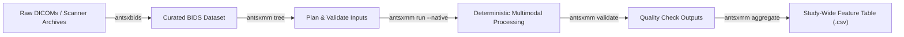

# Getting Started with ANTsXMM

ANTsXMM is the modern, modular multimodal neuroimaging orchestration engine for the **ANTsX ecosystem**. It bridges BIDS datasets curated by [**antsxbids**](https://github.com/ANTsX/antsxbids) with robust scientific processing powered by [**ANTsPy**](https://github.com/ANTsX/ANTsPy), [**ANTsPyT1w**](https://github.com/ANTsX/ANTsPyT1w), and [**ANTsPyNet**](https://github.com/ANTsX/ANTsPyNet).

---

## 1. The ANTsX Ecosystem: From `antsxbids` to `antsxmm`

A typical neuroimaging study follows a two-stage workflow within the ANTsX family:



### Stage 1: BIDS Curation with `antsxbids`
[`antsxbids`](https://github.com/ANTsX/antsxbids) organizes heterogeneous raw scanner data into standardized BIDS structures, generating essential sidecar metadata:
- Diffusion sidecars: `*_dwi.bval`, `*_dwi.bvec`, and `*_dwi.json` (specifying `PhaseEncodingDirection` for distortion correction).
- Functional sidecars: `*_bold.json` (recording `RepetitionTime`, slice timing, and phase-encoding).
- Structural images: `*_T1w.nii.gz` and `*_FLAIR.nii.gz` placed in `anat/`.
- Perfusion & PET images: placed in `perf/` (`*_asl.nii.gz`) and `pet/` (`*_pet.nii.gz`).

### Stage 2: Multimodal Orchestration with `antsxmm`
`antsxmm` parses the `antsxbids` tree, discovers all complementary modalities per subject and session, pairs opposite phase-encoding directions (e.g., AP/PA), builds deterministic execution plans, and runs scientific pipelines natively.

```
BIDS_PROJECT_ROOT/
├── sub-01/
│   ├── ses-01/
│   │   ├── anat/
│   │   │   ├── sub-01_ses-01_T1w.nii.gz
│   │   │   └── sub-01_ses-01_FLAIR.nii.gz
│   │   ├── dwi/
│   │   │   ├── sub-01_ses-01_dwi.nii.gz
│   │   │   ├── sub-01_ses-01_dwi.bval
│   │   │   └── sub-01_ses-01_dwi.bvec
│   │   ├── func/
│   │   │   └── sub-01_ses-01_task-rest_bold.nii.gz
│   │   ├── perf/
│   │   │   └── sub-01_ses-01_asl.nii.gz
│   │   └── pet/
│   │       └── sub-01_ses-01_pet.nii.gz
```

---

## 2. Installation

Install ANTsXMM directly using `pip`:

```bash
# Core installation
pip install antsxmm

# With development and testing dependencies
pip install "antsxmm[test]"
```

Or install from source:

```bash
git clone https://github.com/stnava/antsxmm.git
cd antsxmm
make install
```

Verify your installation:

```bash
antsxmm --help
```

---

## 3. Command Line Quickstart

### Step 1: Preview the Execution Plan (`antsxmm tree`)
Inspect what modalities and runs `antsxmm` discovers before running any compute:

```bash
# Preview all subjects in the BIDS study
antsxmm tree /path/to/bids_root

# Preview a single subject
antsxmm tree /path/to/bids_root/sub-01
```

### Step 2: Run Multimodal Processing (`antsxmm run`)
Process a session using the modern native execution engine:

```bash
# Run a single session natively
antsxmm run /path/to/bids_root /path/to/output_dir \
  --project MyStudy \
  --participant-label sub-01 \
  --session-label ses-01 \
  --native

# Dry-run without executing to verify command dispatch
antsxmm run /path/to/bids_root /path/to/output_dir \
  --project MyStudy \
  --participant-label sub-01 \
  --dry-run --verbose

# Run the entire study with automated resumption
antsxmm run /path/to/bids_root /path/to/output_dir \
  --project MyStudy \
  --native \
  --resume
```

### Step 3: Verify Output Completeness (`antsxmm validate`)
Ensure all planned outputs and metric tables were generated without errors:

```bash
antsxmm validate /path/to/bids_root /path/to/output_dir
```

### Step 4: Aggregate Study-Wide Analysis Table (`antsxmm aggregate`)
Merge all individual modality wide-tables into a single machine-learning-ready CSV:

```bash
antsxmm aggregate /path/to/output_dir --output /path/to/output_dir/study_wide_metrics.csv
```

---

## 4. ANTsPy-Style Python API

In addition to CLI automation, `antsxmm` functions can be called directly in Python using standard ANTsPy conventions.

### 4.1. Motion Correction & Registration (`antsxmm.registration`)

```python
import ants
import antsxmm.registration as areg

# Load 4D timeseries (e.g. resting-state fMRI or ASL)
bold_img = ants.image_read("sub-01_ses-01_task-rest_bold.nii.gz")

# Generate an unbiased motion-corrected temporal average template
avg_bold = areg.get_average_rsf(bold_img, min_t=5, max_t=30)

# Perform 4D motion correction with framewise displacement tracking
moco = areg.timeseries_reg(
    image=bold_img,
    fixed=avg_bold,
    type_of_transform="antsRegistrationSyNRepro[r]"
)

corrected_bold = moco["motion_corrected"]
framewise_disp = moco["FD"]
print(f"Mean Framewise Displacement: {framewise_disp.mean():.4f} mm")
```

### 4.2. White Matter Hyperintensity (WMH) Segmentation (`antsxmm.segmentation`)

```python
import ants
import antsxmm.segmentation as aseg

# Load structural T1w and T2-FLAIR images
t1 = ants.image_read("sub-01_ses-01_T1w.nii.gz")
flair = ants.image_read("sub-01_ses-01_FLAIR.nii.gz")

# Run deep-learning WMH segmentation with SNR quantification
wmh_output = aseg.wmh(flair_image=flair, t1_image=t1)

prob_map = wmh_output["WMH_probability_map"]
wmh_mass = wmh_output["wmh_mass"]
wmh_snr = wmh_output["wmh_SNR"]
print(f"WMH Mass: {wmh_mass:.2f}, WMH SNR: {wmh_snr:.2f}")

# Save lesion probability map
ants.image_write(prob_map, "sub-01_ses-01_wmh_prob.nii.gz")
```

### 4.3. Diffusion Tensor Imaging & Tractography (`antsxmm.modalities.dti`)

```python
import numpy as np
import ants
import antsxmm.modalities.dti as adti

# Load DWI image, bvals, and bvecs
dwi = ants.image_read("sub-01_ses-01_dwi.nii.gz")
bvals = np.loadtxt("sub-01_ses-01_dwi.bval")
bvecs = np.loadtxt("sub-01_ses-01_dwi.bvec").T

# Ensure unit norm on gradient directions
repaired_bvecs = adti.repair_bvecs(bvecs)

# Fit diffusion tensors
dti_fit = adti.efficient_dwi_fit(
    image=dwi,
    bval_file="sub-01_ses-01_dwi.bval",
    bvec_file="sub-01_ses-01_dwi.bvec",
    robust=True
)

fa_image = dti_fit["fa"]
md_image = dti_fit["md"]
ants.image_write(fa_image, "sub-01_ses-01_FA.nii.gz")
```

### 4.4. Resting-State fMRI Spectral & Amplitude Analysis (`antsxmm.modalities.fmri`)

```python
import numpy as np
import ants
import antsxmm.modalities.fmri as afmri
import antsxmm.modalities.metrics as amet

bold = ants.image_read("sub-01_ses-01_task-rest_bold.nii.gz")
mask = ants.get_mask(ants.slice_image(bold, axis=3, idx=0))

# Compute temporal SNR (tSNR) and DVARS
tsnr_map = amet.tsnr(bold, mask=mask)
dvars_trace = amet.dvars(bold, mask=mask)

# Compute 3D Amplitude of Low-Frequency Fluctuation (ALFF)
alff_img = afmri.alff_image(bold, flo=0.01, fhi=0.08, tr=2.0)
ants.image_write(alff_img, "sub-01_ses-01_alff.nii.gz")
```

### 4.5. Arterial Spin Labeling & Quantitative CBF (`antsxmm.modalities.perfusion`)

```python
import ants
import antsxmm.modalities.perfusion as aperf

# Load ASL timeseries
asl = ants.image_read("sub-01_ses-01_asl.nii.gz")

# Calculate quantitative Cerebral Blood Flow (CBF)
cbf_result = aperf.calculate_CBF(
    asl,
    pld=1.8,
    label_duration=1.8,
    tissue_t1=1.65,
    blood_t1=1.65
)

cbf_map = cbf_result["cbf"]
ants.image_write(cbf_map, "sub-01_ses-01_cbf.nii.gz")
```

### 4.6. Positron Emission Tomography SUVR Quantification (`antsxmm.modalities.pet`)

```python
import ants
import antsxmm.modalities.pet as apet

pet = ants.image_read("sub-01_ses-01_pet.nii.gz")
t1 = ants.image_read("sub-01_ses-01_T1w.nii.gz")
labels = ants.image_read("sub-01_ses-01_parcellation.nii.gz")

# Coregister 3D PET to structural T1w and compute regional SUVR
pet_summary = apet.pet3d_summary(
    pet=pet,
    t1=t1,
    segmentation=labels,
    reference_label=1  # e.g., cerebellum reference
)

print(pet_summary["suvr_table"].head())
```

---

## 5. High-Performance Cluster & SLURM Usage

When running large studies on SLURM clusters, ANTsXMM automatically coordinates threading across OpenBLAS, MKL, ITK, and TensorFlow:

```bash
#!/bin/bash
#SBATCH --job-name=antsxmm
#SBATCH --cpus-per-task=8
#SBATCH --mem=32G
#SBATCH --time=12:00:00

# ANTsXMM automatically detects SLURM_CPUS_PER_TASK
export ANTSXMM_THREADS=${SLURM_CPUS_PER_TASK:-8}

antsxmm run /scratch/data/BIDS/Study /scratch/data/Outputs/Study \
  --project Study \
  --native \
  --resume
```

---

## 6. Verification and Quality Assurance

Run the comprehensive test suite locally:

```bash
make audit
```
This runs:
1. `make compile`: Bytecode verification ensuring 0 syntax warnings.
2. `make lint`: Ruff static analysis and security checks.
3. `make test`: Full 138-test pytest suite covering registration, segmentation, all modalities, and end-to-end BIDS lifecycle.
